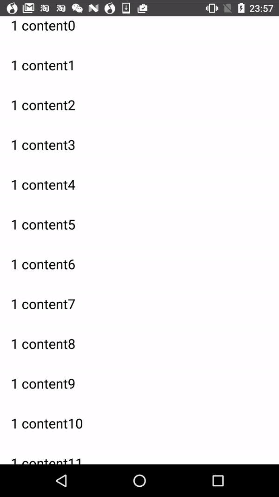

## VerticalViewPager

An vertical scrollable ViewPager implementation.Works well with vertical RecyclerView and ListView, though i havn't test it with other View, but i believe it will work too. Feel free to use it with other View.

In the latest work, we need a vertical scrollable ViewPager, and Android ViewPager only support horizontal scroll, there are already some work such as [kaelaela/VerticalViewPager](https://github.com/kaelaela/VerticalViewPager) and [DragScrollDetailsLayout](https://github.com/happylishang/DragScrollDetailsLayout), but they are not meet our conditions. So I figure out an implementation and build this project.

## Screenshots
  

## How does it work?

Use ViewPager's fake drag feature and View.OnTouchListener to manage the touch events. 
  * DummyViewPager override the onInterceptTouchEvent method and return false, dispatch touch events to it's children;
  * Set VerticalVPOnTouchListener as the View.OnTouchListener of the child view (RecyclyerView\ListVeiw...), VerticalVPOnTouchListener manages the child view's scroll and fake the ViewPager's scroll;
  * Read the source code.
  
I build my project based on [kaelaela/VerticalViewPager](https://github.com/kaelaela/VerticalViewPager), but we use completely different implementations.

## Next:

- [ ] Add more examples;
- [ ] Better ReadMe;

## Me

Chad Guo
* guochongscut@gmail.com

License
-------
Please [LICENSE](https://github.com/guochong/VerticalViewPager-chad/blob/master/LICENSE)。
